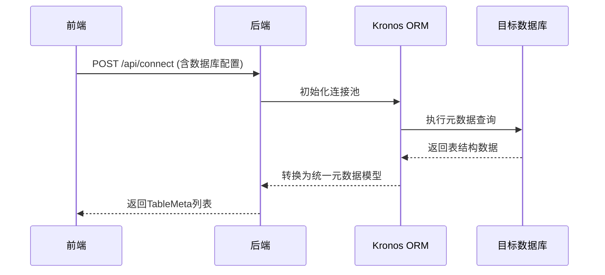

# Kronos ORM 代码生成器

## 介绍

Kronos ORM 代码生成器是一个用于快速生成 Kotlin ORM 代码的工具，支持多种数据库和模板引擎。它可以帮助开发者快速创建实体类、DAO、Service
等代码，减少手动编写的工作量，提高开发效率。

## 特性

| 功能         | 说明                                 |
|------------|------------------------------------|
| **模板存储**   | 支持本地文件系统或数据库存储模板                   |
| **版本控制**   | 记录模板修改历史，支持回滚到旧版本                  |
| **变量注入**   | 允许用户自定义模板变量（如作者、时间、版权声明）           |
| **模板共享**   | 导入/导出模板包（.zip或自定义格式），便于团队协作        |
| **多数据源支持** | 支持连接多个数据库，生成不同数据源的代码               |
| **多数据库支持** | 支持多种数据库（如MySQL、PostgreSQL、Oracle等） |
| **多平台支持**  | 支持多种操作系统（如Windows、Linux、macOS等）    |

## 使用方法

1. **安装依赖**：确保你的项目中已经添加了Kronos ORM Code Generator的依赖。
   ```kotlin
   dependencies {
       implementation("com.kotlinorm:kronos-code-generator:1.0.0")
   }
   ```
2. **配置数据库连接**：在代码生成器中配置数据库连接信息，包括数据库类型、地址、用户名和密码等。
3. **选择模板**：选择你需要的模板，可以是内置的模板或自定义的模板。
4. **生成代码**：点击生成按钮，代码生成器会根据配置和模板生成相应的代码文件。
5. **查看生成结果**：生成完成后，可以在指定的输出目录中查看生成的代码文件。

## 流程图



## 功能模块

| 模块       | 功能描述                               |
|----------|------------------------------------|
| **项目管理** | 创建/打开项目，配置数据库连接、输出目录、包名等           |
| **模板管理** | 增删改查模板，支持模板分类（如Entity、DAO、Service） |
| **生成配置** | 关联表与模板，设置生成策略（覆盖/跳过）               |
| **实时预览** | 编辑模板时实时渲染生成的代码效果                   |
| **执行日志** | 显示代码生成过程和错误信息                      |