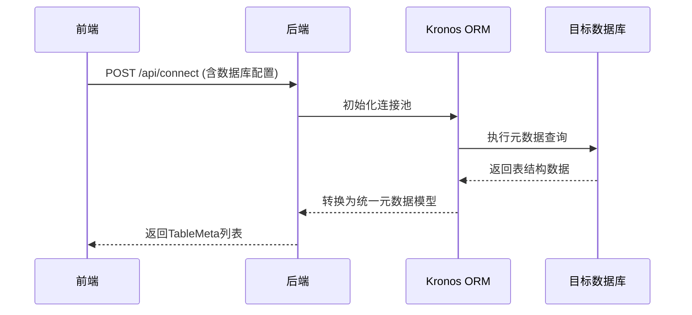

# Kronos ORM Code Generator

## Introduction

Kronos ORM Code Generator is a tool for quickly generating Kotlin ORM code , supports a variety of databases and
template engines . It helps developers quickly create entity classes, DAOs, Service
and other code to reduce the workload of manual writing and improve development efficiency .

## Features

| Functions                     | Description                                                                           |
|-------------------------------|---------------------------------------------------------------------------------------|
| **Template Storage**          | Supports local file system or database storage of templates                           |
| **Version Control**           | Record template modification history, support rollback to old versions                |
| **Variable Injection**        | Allow users to customize template variables (e.g. author, time, copyright notice)     |
| **Template Sharing**          | Import/Export template packages (.zip or customized format) for team collaboration    |
| **Multi-data-source support** | Supports connecting to multiple databases to generate code for different data sources |
| **Multi-Database Support**    | Supports multiple databases (e.g. MySQL, PostgreSQL, Oracle, etc)                     |
| **Multi-Platform Support**    | Support multiple operating systems (e.g. Windows, Linux, macOS, etc.)                 |

## Usage

1. **Installation of dependencies**: Make sure you have added the dependencies of Kronos ORM Code Generator to your
   project.
   ```kotlin
   dependencies {
      implementation("com.kotlinorm:kronos-code-generator:0.0.1-SNAPSHOT")
   }
   ```
2. **Configure database connection**: Configure the database connection information in the code generator, including the
   database type, address, username and password.
3. **Select Template**: select the template you need, it can be built-in template or customized template.
4. **Generate Code**: Click the Generate button, the code generator will generate the corresponding code file according
   to the configuration and template.
5. **View Generation Result**: After the generation is completed, you can view the generated code file in the specified
   output directory.

## Flowchart



## Function Module

| Module                       | Function Description                                                                              |
|------------------------------|---------------------------------------------------------------------------------------------------|
| **Project Management**       | Create/open project, configure database connection, output directory, package name, etc           |
| **Template Management**      | Add, Delete, Change, Check templates, support template categorization (e.g. Entity, DAO, Service) |
| **Generation Configuration** | Associate tables with templates, set generation policy (override/skip)                            |
| **Real-time preview**        | Edit template real-time rendering of the generated code effect                                    |
| **Execution log**            | Display code generation process and error messages                                                |